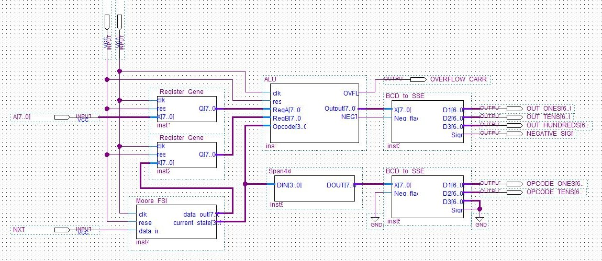

# Simple-Central-Processing-Unit

A simple 8-bit CPU designed in VHDL for the Altera DE2 FPGA Board. Modified and generalized based on my Digital Systems (COE 328) final project. Comprised of an Arithmetic Logic Unit, General Purpose Registers, Finite State Machine Based Control Unit, and BCD to Seven Segment Decoders. 
  

## Contents

- [**Preliminary**](#preliminary)
- [**Components**](#components)
   - [**General Purpose Registers**](#general-purpose-registers)
   - [**Finite State Machine**](#finite-state-machine)
   - [**Arithmetic Logic Unit**](#arithmetic-logic-unit)
   - [**BCD to Seven Segment Decoders**](#bcd-to-seven-segment-decoders)
- [**Notes**](#notes)

## Preliminary

The user can create a simple program by providing data to register A and modifying the FSM state sequences and output data.

|Opcode|Operation|
|------|---------|
|0001|Add A and B|
|0010|Subtract B from A|
|0011|A AND B|
|0100|A OR B|
|0101|A XOR B|
|0110|NOT A|
|0111|A NAND B|
|1000|A NOR B|
|1001|A XNOR B|
|1010|Shift A Right by 1|
|1011|Shift A Left by 1|

## Components

### General Purpose Registers
Design uses two generic 8-bit registers to latch input data on the rising edge of the clock signal. Output is passed into the ALU.

*Active Low* Reset is used to reset the registers to 0.

- Input of register A is exposed to the user who can use the slide switches on the DE2 to toggle individual bits.
- Input of register B is connected to the data output of the FSM control unit
  
### Finite State Machine
A Moore Finite State Machine was originally used in the COE 328 project to display each digit of my student number. Instead of using a dedicated instruction register and program counter in this version, I repurposed the FSM so that each state represents an ALU opcode, with the state output passed into register B.

- The user can program the state sequences and outputs of the FSM to execute a simple program.
- Pin NXT is used to advance to the next state.
- The current opcode is displayed using a BCD to Seven Segment Decoder.

### Arithmetic Logic Unit
The arithemtic logic unit can perform Unsigned Addition, Signed Subtraction, Bitwise Operations, and Bitshifting upon inputs A and B during the rising edge of the clock signal. 

*Active Low* Reset is used to reset the output to 0.

- Negative flag bit indicates a signed output and is used to display the negative sign on the seven segment displays.
- Carry / Overflow flag indicates whether a result should be ignored.
  - Carry condition occurs during unsigned addition where the result is greater than 8-bits.
  - Overflow condition occurs during signed subtraction if $(A \oplus B) + (A \oplus Result) = True$.

### BCD to Seven Segment Decoders
The BCD to seven segment decoders first convert an 8-bit number to 3 BCD digits by the Shift & Add 3 method. Each BCD digit is decoded into a seven segment display output.

- Shift & Add 3 method avoids the computationally intensive division and modulo operations sometimes used in BCD conversion on microcontrollers.
- As previously stated, the seven segment displays on the DE2 are common anode (active low) so the output logic of the BCD decoders is inverted.

## Notes
- Project designed using Quartus II
- The Altera DE2 FPGA Board uses active low pushbuttons so the reset pin was made to be active low as well
- Similarly, the seven segment displays are common anode (active low) so the output logic of the BCD decoders is inverted
